<!-- <p align="center"></p>
<p align="center"></p> -->
<h2 align="center">Mostre suas habilidades em seu GitHub ou currículo com facilidade!</h2>

# 🔍Índice
  - [Escolhendo Ícones](#escolhendo-ícones)
  - [Temas](#temas)
  - [Ícones Por Linha](#ícones-por-linha)
  - [Centralizando Ícones](#centralizando-ícones)
  - [Ícones](#ícones)
    - [API's e Bibliotecas](#apis-e-bibliotecas)
    - [Análise de Dados, Data Science e IA](#análise-de-dados-data-science-e-ia)
    - [Armazenamento, Banco de Dados e ORM's](#armazenamento-banco-de-dados-e-orms)
    - [Automação, Teste e Versionamento](#automação-teste-e-versionamento)
    - [Cloud e Infraestrutura](#cloud-e-infraestrutura)
    - [Desenvolvimento de Jogos e Engine](#desenvolvimento-de-jogos-e-engine)
    - [Design e Mídia](#design-e-midia)
    - [Educação](#educacao)
    - [Empresas](#empresas)
    - [Estilização e Marcação](#estilizacao-e-marcacao)
    - [Ferramentas de Build e Gerenciador de Pacotes](#ferramentas-de-build-e-gerenciador-de-pacotes)
    - [Frameworks](#frameworks)
    - [Hardware](#hardware)
    - [IDE's e Editores de Texto](#ides-e-editores-de-texto)
    - [Linguagens de Programação](#linguagens-de-programacao)
    - [Redes Sociais](#redes-sociais)
    - [Sistemas Operacionais](#sistemas-operacionais)

# 🧩Escolhendo Ícones

Copie e cole o bloco de código abaixo em seu README para adicionar o elemento do ícone de habilidades!

Altere `?i=js,html,css` para uma lista de suas habilidades separadas por ",". Você pode encontrar a lista completa de ícones disponíveis [aqui](#ícones).

```md
[](https://iconsverce.vercel.app)
```

[](https://iconsverce.vercel.app)

# 🎨Temas

Os ícones têm um fundo temático que varia entre as opções ,`colored`, `dark` e `light`. Você pode especificar qual tema deseja como parâmetro de URL.

Isso é opcional. O tema padrão é `colored`.

Altere `&theme=light` para definir o tema como `light`. O tema é a cor de fundo, então o tema `light` tem um fundo de ícone branco e o `dark` tem um fundo preto.

**Exemplo de tema `light`:**

```md
[](https://iconsverse.vercel.app)
```

[](https://iconsverse.vercel.app)

# 📏Ícones Por Linha
`&perline=3` Define quantos ícones devem aparecer por linha. É um argumento opcional e o padrão é 15. Aceita qualquer número entre 1 e 50.

```md
[](https://iconsverse.vercel.app)
```

[](https://iconsverse.vercel.app)

# 🎯Centralizando Ícones
Os SVGs são redimensionados automaticamente, então você pode centraliza-los como uma imagem.

```html
<p align="center">
  <a href="https://iconsverse.vercel.app">
    
  </a>
</p>
```

<p align="center">
  <a href="https://iconsverse.vercel.app">
    
  </a>
</p>

# 📁Ícones

Aqui está uma lista de todos os ícones suportados atualmente. Sinta-se à vontade para abrir uma issue para sugerir ícones para adicionar!

### API's e Bibliotecas
| ID do Ícone | `colorful` | `dark` | `light` |
| :---------: | :-----: | :--: | :---: |
| `activitypub` |  |  |  |
| `apollo` |  |  |  |
| `appwrite` |  |  |  |
| `d3` |  |  |  |
| `deno` |  |  |  |
| `discordjs` |  |  |  |
| `emotion` |  |  |  |
| `graphql` |  |  |  |
| `htmx` |  |  |  |
| `jquery` |  |  |  |
| `lit` |  |  |  |
| `materialui` |  |  |  |
| `p5js` |  |  |  |
| `pinia` |  |  |  |
| `react` |  |  |  |
| `reactivex` |  |  |  |
| `redux` |  |  |  |
| `solidjs` |  |  |  |
| `styledcomponents` | 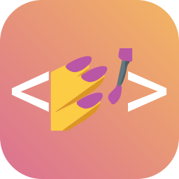 | 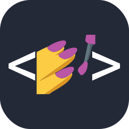 | 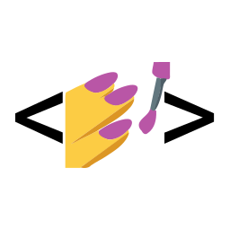 |
| `threejs` |  |  |  |

### Análise de Dados, Data Science e IA
| ID do Ícone | `colorful` | `dark` | `light` |
| :---------: | :-----: | :--: | :---: |
| `alteryx` |  |  |  |
| `grafana` |  |  |  |
| `julia` |  |  |  |
| `matlab` |  |  |  |
| `octave` |  |  |  |
| `opencv` |  |  |  |
| `powerbi` |  |  |  |
| `prometheus` |  |  |  |
| `pytorch` |  |  |  |
| `scikitlearn` |  |  |  |
| `sentry` |  |  |  |
| `tensorflow` |  |  |  |

### Armazenamento, Banco de Dados e ORM’s
| ID do Ícone | `colorful` | `dark` | `light` |
| :---------: | :-----: | :--: | :---: |
| `cassandra` | 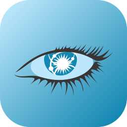 | 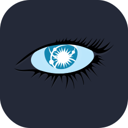 | 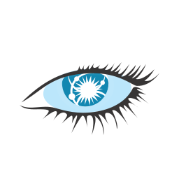 |
| `dynamodb` | 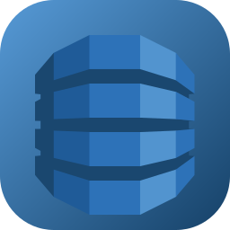 | 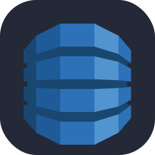 | 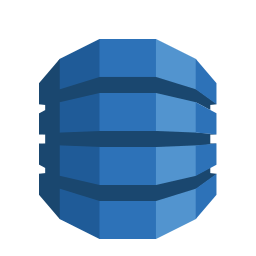 |
| `elasticsearch` | 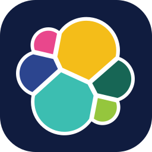 | 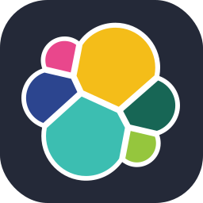 | 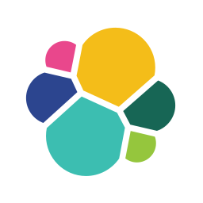 |
| `firebase` | 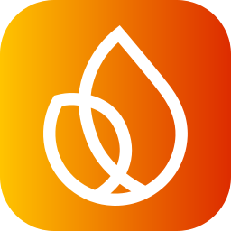 | 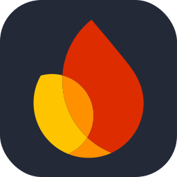 | 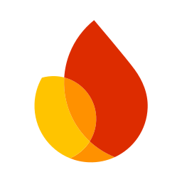 |
| `mongodb` | 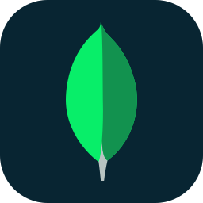 | 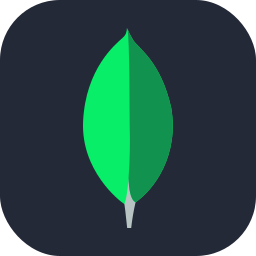 | 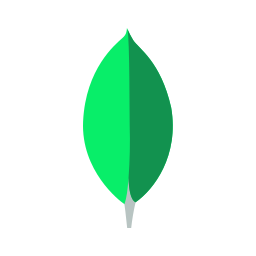 |
| `mysql` | 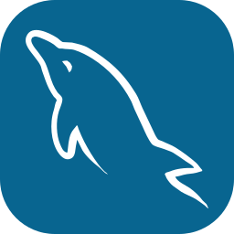 | 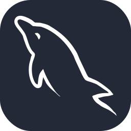 | 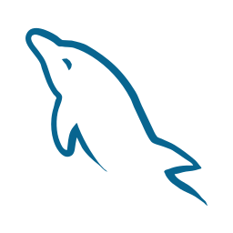 |
| `neon` | 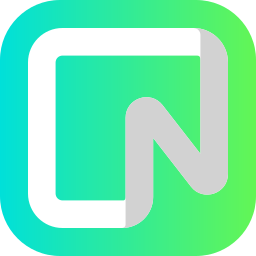 | 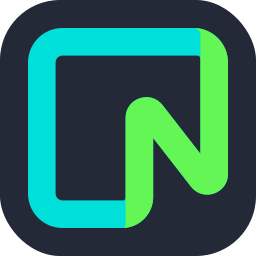 |  |
| `planetscale` | 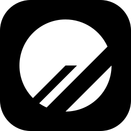 | 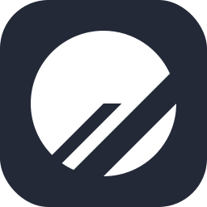 | 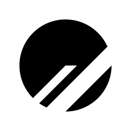 |
| `postgresql` | 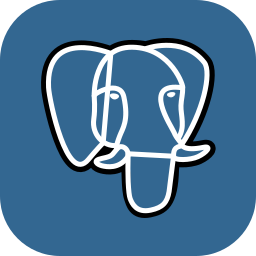 |  |  |
| `prisma` | 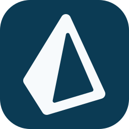 | 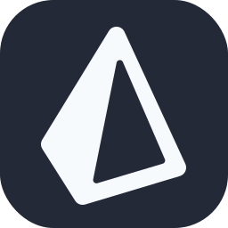 | 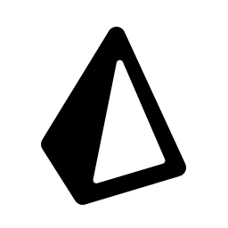 |
| `redis` | 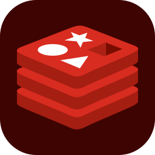 | 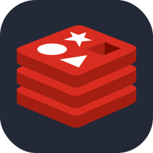 | 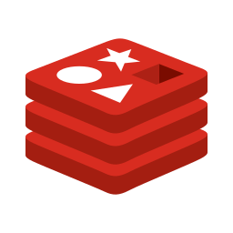 |
| `sequelize` | 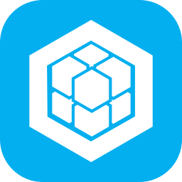 | 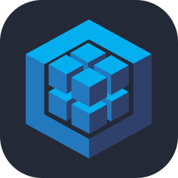 | 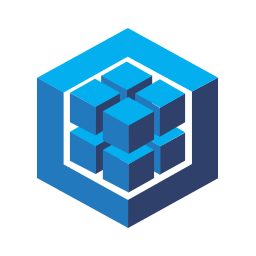 |
| `sqlite` |  |  |  |

### Automação, Teste e Versionamento
| ID do Ícone | `colorful` | `dark` | `light` |
| :---------: | :-----: | :--: | :---: |
| `ansible` |  |  | 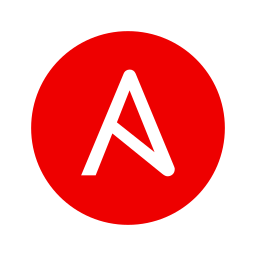 |
| `bash` | 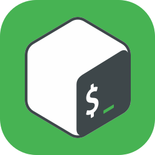 | 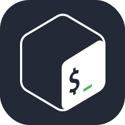 | 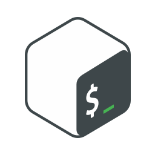 |
| `bitbucket` | 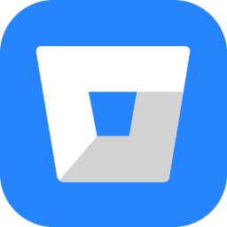 | 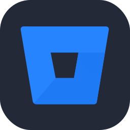 |  |
| `cypress` |  |  |  |
| `gherkin` |  |  |  |
| `git` | 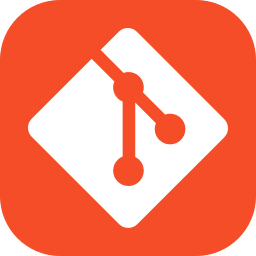 | 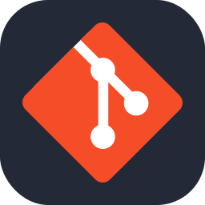 | 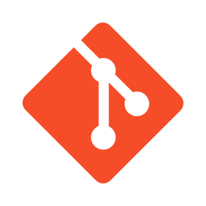 |
| `github` |  |  | 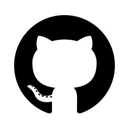 |
| `githubactions` |  | 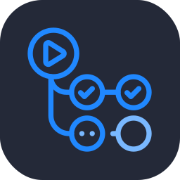 |  |
| `gitlab` | 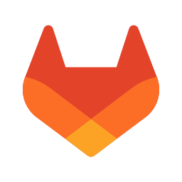 | 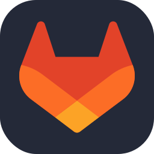 | 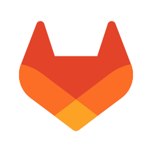 |
| `jenkins` |  |  |  |
| `jest` |  |  |  |
| `postman` |  |  |  |
| `powershell` |  |  |  |
| `selenium` |  |  |  |
| `vitest` |  |  |  |

### Cloud e Infraestrutura
| ID do Ícone | `colorful` | `dark` | `light` |
| :---------: | :-----: | :--: | :---: |
| `aws` |  |  |  |
| `azure` |  |  |  |
| `cloudflare` |  |  |  |
| `docker` |  |  |  |
| `gcp` |  |  |  |
| `heroku` |  |  |  |
| `ipfs` |  |  |  |
| `kafka` |  |  |  |
| `kubernetes` |  |  |  |
| `netlify` |  |  |  |
| `nginx` |  |  |  |
| `openshift` |  |  |  |
| `openstack` |  |  |  |
| `rabbitmq` |  |  |  |
| `supabase` |  |  |  |
| `terraform` |  |  |  |
| `vercel` |  |  |  |
| `workers` |  |  |  |


### Desenvolvimento de Jogos e Engines
| ID do Ícone | `colorful` | `dark` | `light` |
| :---------: | :-----: | :--: | :---: |
| `bevy` |  |  |  |
| `gamemakerstudio` |  |  |  |
| `godot` |  |  |  |
| `haxe` |  |  |  |
| `haxeflixel` |  |  |  |
| `processing` |  |  |  |
| `robloxstudio` |  |  |  |
| `unity` |  |  |  |
| `unrealengine` |  |  |  |

### Design e Mídia
| ID do Ícone | `colorful` | `dark` | `light` |
| :---------: | :-----: | :--: | :---: |
| `ableton` |  |  |  |
| `aftereffects` |  |  |  |
| `audition` |  |  |  |
| `blender` |  |  |  |
| `figma` |  |  |  |
| `illustrator` |  |  |  |
| `photoshop` |  |  |  |
| `premiere` |  |  |  |
| `sketchup` |  |  |  |
| `webflow` |  |  |  |
| `xd` |  |  |  |

### Educação
| ID do Ícone | `colorful` | `dark` | `light` |
| :---------: | :-----: | :--: | :---: |
| `ada` |  |  |  |
| `alura` |  |  |  |
| `balta` |  |  |  |
| `cev` |  |  |  |
| `dio` |  |  |  |
| `loiane` |  |  |  |
| `rocketseat` |  |  |  |

### Empresas
| ID do Ícone | `colorful` | `dark` | `light` |
| :---------: | :-----: | :--: | :---: |
| `apple` |  |  |  |
| `bradesco` |  |  |  |
| `microsoft` |  |  |  |
| `redhat` |  |  |  |
| `santander` |  |  |  |
| `squadio` |  |  |  |

### Estilização e Marcação
| ID do Ícone | `colorful` | `dark` | `light` |
| :---------: | :-----: | :--: | :---: |
| `css` |  |  |  |
| `html` |  |  |  |
| `latex` |  |  |  |
| `less` |  |  |  |
| `markdown` |  |  |  |
| `pug` |  |  |  |
| `regex` |  |  |  |
| `sass` |  |  |  |
| `svelte` |  |  |  |
| `webassembly` |  |  |  |

### Ferramentas de Build e Gerenciador de Pacotes
| ID do Ícone | `colorful` | `dark` | `light` |
| :---------: | :-----: | :--: | :---: |
| `anaconda` |  |  |  |
| `babel` |  |  |  |
| `bun` |  |  |  |
| `cmake` |  |  |  |
| `gradle` |  |  |  |
| `gulp` |  |  |  |
| `maven` |  |  |  |
| `npm` |  |  |  |
| `pnpm` |  |  |  |
| `rollupjs` |  |  |  |
| `vite` |  |  |  |
| `webpack` |  |  |  |
| `yarn` |  |  |  |

### Frameworks
| ID do Ícone | `colorful` | `dark` | `light` |
| :---------: | :-----: | :--: | :---: |
| `actix` |  |  |  |
| `adonis` |  |  |  |
| `alpinejs` |  |  |  |
| `angular` |  |  |  |
| `astro` |  |  |  |
| `azul` |  |  |  |
| `bootstrap` |  |  |  |
| `django` |  |  |  |
| `dotnet` |  |  |  |
| `electron` |  |  |  |
| `elysia` |  |  |  |
| `ember` |  |  |  |
| `expressjs` |  |  |  |
| `fastapi` |  |  |  |
| `flask` |  |  |  |
| `flutter` |  |  |  |
| `gastby` |  |  |  |
| `gtk` |  |  |  |
| `hibernate` |  |  |  |
| `ktor` |  |  |  |
| `laravel` |  |  |  |
| `nestjs` |  |  |  |
| `nextjs` |  |  |  |
| `nuxts` |  |  |  |
| `qt` |  |  |  |
| `rails` |  |  |  |
| `remix` |  |  |  |
| `rocket` |  |  |  |
| `spring` |  |  |  |
| `symfony` |  |  |  |
| `tailwindcss` |  |  |  |
| `tauri` |  |  |  |
| `vuejs` |  |  |  |
| `vuetify` |  |  |  |
| `windicss` |  |  |  |
| `wordpress` |  |  |  |
| `yew` |  |  |  |

### Hardware
| ID do Ícone | `colorful` | `dark` | `light` |
| :---------: | :-----: | :--: | :---: |
| `arduino`     |     |  |  |
| `autocad`     |     |  |  |
| `raspberrypi` |  |  |  |
| `ros`         |         |      |     |

### IDE’s e Editores de Texto
| ID do Ícone | `colorful` | `dark` | `light` |
| :---------: | :-----: | :--: | :---: |
| `androidstudio` |  |  |  |
| `atom`          |        |    |   |
| `clion`         |       |   |  |
| `codepen`       |     |  |  |
| `eclipse`       |     |  |  |
| `emacs`         |       |    |  |
| `idea`          |        |     |   |
| `neovim`        |      |  |  |
| `notion`        |      |  |  |
| `obsidian`      |    |  |  |
| `phpstorm`      |    |  |  |
| `pycharm`       |     |  |  |
| `replit`        |      |  |  |
| `rider`         |       |   |  |
| `sublime`       |     |  |  |
| `vim`           |         |     |   |
| `visualstudio`  |  |  |  |
| `vscode`        |      |  |  |
| `vscodium`      |    |  |  |
| `webstorm`      |    |  |  |

### Linguagens de Programação
| ID do Ícone | `colorful` | `dark` | `light` |
| :---------: | :-----: | :--: | :---: |
| `c`            |         |    |   |
| `cpp`          |       |  | |
| `cs`           |        |   |  |
| `clojure`      |   |  |  |
| `coffeescript` |  |  |  |
| `crystal`      |   |  |  |
| `dart`         |      |  |  |
| `elixir`       |    |  |  |
| `forth`        |     |  |  |
| `fortran`      |   |  |  |
| `golang`       |        |    |   |
| `haskell`      |   |  |  |
| `java`         |      |  |  |
| `javascript`   |  |  |  |
| `kotlin`       |    |  |  |
| `lua`          |       |   |  |
| `nim`          |       |   |  |
| `nodejs`       |    |  |  |
| `ocaml`        |     |  |  |
| `perl`         |      |   |  |
| `php`          |       |    |  |
| `python`       |    |  |  |
| `r`            |         |      |     |
| `ruby`         |      |   |  |
| `rust`         |      |   |  |
| `scala`        |     |  |  |
| `solidity`     |  |  |  |
| `swift`        |     |  |  |
| `typescript`   |  |  |  |
| `v`            |         |      |     |
| `vala`         |      |   |  |
| `zig`          |       |    |   |

### Redes Sociais
| ID do Ícone | `colorful` | `dark` | `light` |
| :---------: | :-----: | :--: | :---: |
| `devto`     |       |  |  |
| `discord`   |     |  |  |
| `fediverse` |   |  |  |
| `gmail`     |       |   |   |
| `instagram` |   |  |  |
| `linkedin`  |    |   |  |
| `mastodon`  |    |   |  |
| `misskey`   |     |    |  |
| `stackoverflow` |  |  |  |
| `x` |  |  |  |

### Sistemas Operacionais
| ID do Ícone | `colorful` | `dark` | `light` |
| :---------: | :-----: | :--: | :---: |
| `arch`      |        |  |  |
| `bsd`       |         |   |   |
| `debian`    |      |  |  |
| `kali`      |        |  |  |
| `linux`     |       |  |  |
| `mint`      |        |  |  |
| `nix`       |         |   |   |
| `plan9`     |       |  |  |
| `ubuntu`    |      |  |  |
| `windows`   |     |  |  |

<!--

## 💖 Support the Project

Thank you so much already for using my projects! If you want to go a step further and support my open source work, buy me a coffee:

<a href='https://ko-fi.com/Q5Q860KQ2' target='_blank'></a>

To support the project directly, feel free to open issues for icon suggestions, or contribute with a pull request! -->
