<!-- <p align="center"></p>
<p align="center"></p> -->
<h2 align="center">Mostre suas habilidades em seu GitHub ou currículo com facilidade!</h2>

# 🔍Índice
  - [Escolhendo Ícones](#escolhendo-ícones)
  - [Temas](#temas)
  - [Ícones Por Linha](#ícones-por-linha)
  - [Centralizando Ícones](#centralizando-ícones)
  - [Ícones](#ícones)
    - [API's e Bibliotecas](#apis-e-bibliotecas)
    - [Análise de Dados, Data Science e IA](#análise-de-dados-data-science-e-ia)
    - [Armazenamento, Banco de Dados e ORM's](#armazenamento-banco-de-dados-e-orms)
    - [Automação, Teste e Versionamento](#automacao-teste-e-versionamento)
    - [Cloud e Infraestrutura](#cloud-e-infraestrutura)
    - [Desenvolvimento de Jogos e Engine](#desenvolvimento-de-jogos-e-engine)
    - [Design e Mídia](#design-e-midia)
    - [Educação](#educacao)
    - [Empresas](#empresas)
    - [Estilização e Marcação](#estilizacao-e-marcacao)
    - [Ferramentas de Build e Gerenciador de Pacotes](#ferramentas-de-build-e-gerenciador-de-pacotes)
    - [Frameworks](#frameworks)
    - [Hardware](#hardware)
    - [IDE's e Editores de Texto](#ides-e-editores-de-texto)
    - [Linguagens de Programação](#linguagens-de-programacao)
    - [Redes Sociais](#redes-sociais)
    - [Sistemas Operacionais](#sistemas-operacionais)

# 🧩Escolhendo Ícones

Copie e cole o bloco de código abaixo em seu README para adicionar o elemento do ícone de habilidades!

Altere `?i=js,html,css` para uma lista de suas habilidades separadas por ",". Você pode encontrar a lista completa de ícones disponíveis [aqui](#ícones).

```md
[](https://iconsverce.vercel.app)
```

[](https://iconsverce.vercel.app)

# 🎨Temas

Os ícones têm um fundo temático que varia entre as opções ,`colored`, `dark` e `light`. Você pode especificar qual tema deseja como parâmetro de URL.

Isso é opcional. O tema padrão é `colored`.

Altere `&theme=light` para definir o tema como `light`. O tema é a cor de fundo, então o tema `light` tem um fundo de ícone branco e o `dark` tem um fundo preto.

**Exemplo de tema `light`:**

```md
[](https://iconsverse.vercel.app)
```

[](https://iconsverse.vercel.app)

# 📏Ícones Por Linha
`&perline=3` Define quantos ícones devem aparecer por linha. É um argumento opcional e o padrão é 15. Aceita qualquer número entre 1 e 50.

```md
[](https://iconsverse.vercel.app)
```

[](https://iconsverse.vercel.app)

# 🎯Centralizando Ícones
Os SVGs são redimensionados automaticamente, então você pode centraliza-los como uma imagem.

```html
<p align="center">
  <a href="https://iconsverse.vercel.app">
    
  </a>
</p>
```

<p align="center">
  <a href="https://iconsverse.vercel.app">
    
  </a>
</p>

# 📁Ícones

Aqui está uma lista de todos os ícones suportados atualmente. Sinta-se à vontade para abrir uma issue para sugerir ícones para adicionar!

### API's e Bibliotecas
| ID do Ícone | Colored | Dark | Light |
| :---------: | :-----: | :--: | :---: |
| `activitypub` | 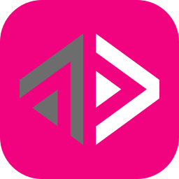 | 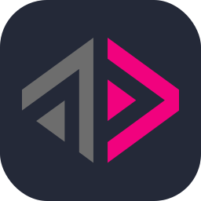 | 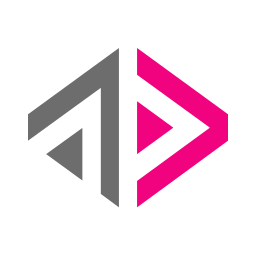 |
| `apollo` |  | 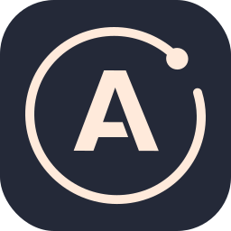 | 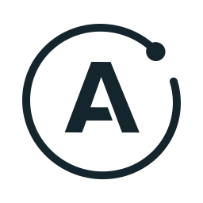 |
| `appwrite` | 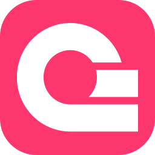 |  | 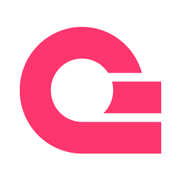 |
| `d3` | 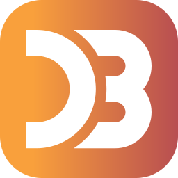 | 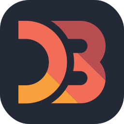 | 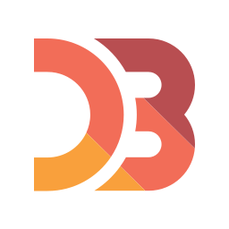 |
| `deno` | 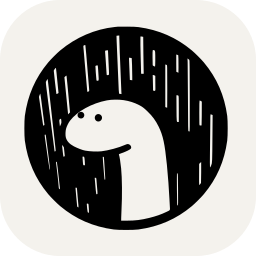 | 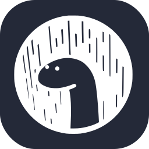 |  |
| `discordjs` |  | 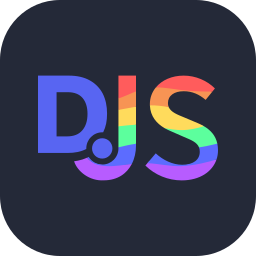 | 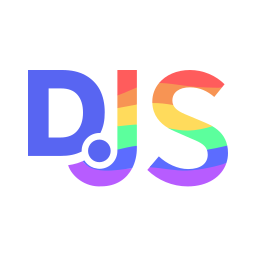 |
| `emotion` | 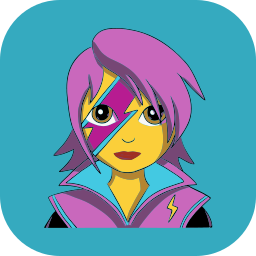 | 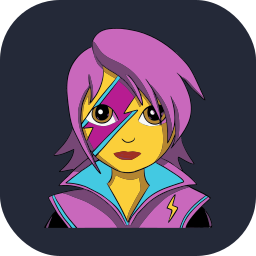 |  |
| `graphql` | 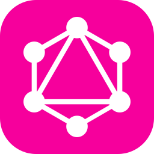 | 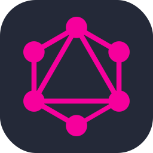 | 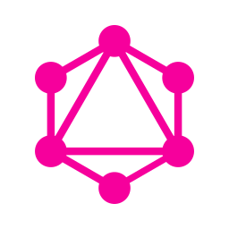 |
| `htmx` | 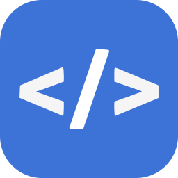 | 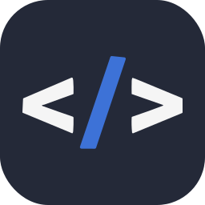 | 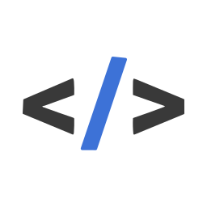 |
| `jquery` |  |  |  |
| `lit` | 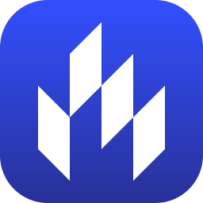 | 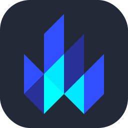 | 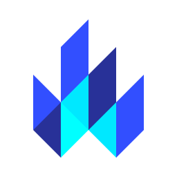 |
| `materialui` |  |  |  |
| `p5js` | 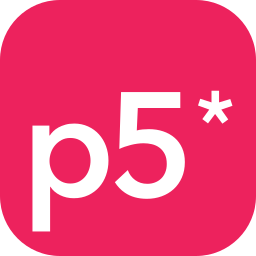 | 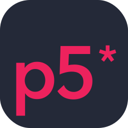 | 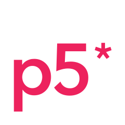 |
| `pinia` |  |  |  |
| `react` | 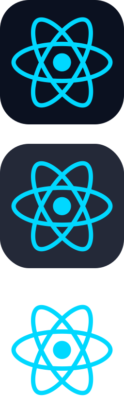 | 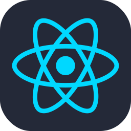 | 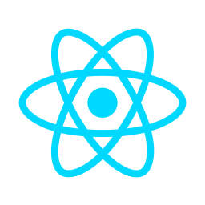 |
| `reactivex` | 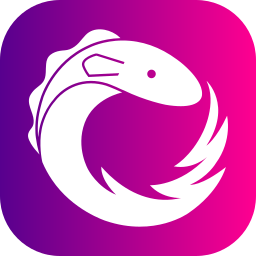 | 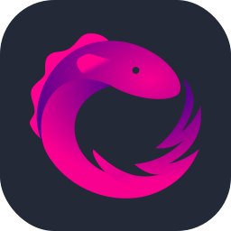 | 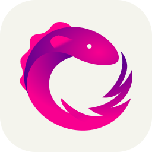 |
| `redux` | 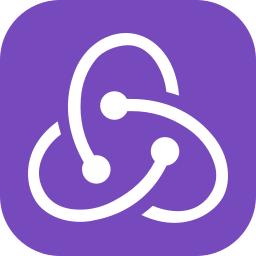 | 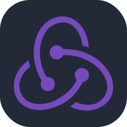 | 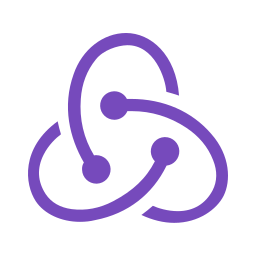 |
| `solidjs` | 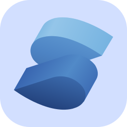 | 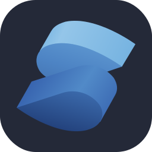 | 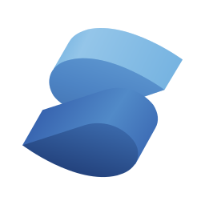 |
| `tailwindcss` | 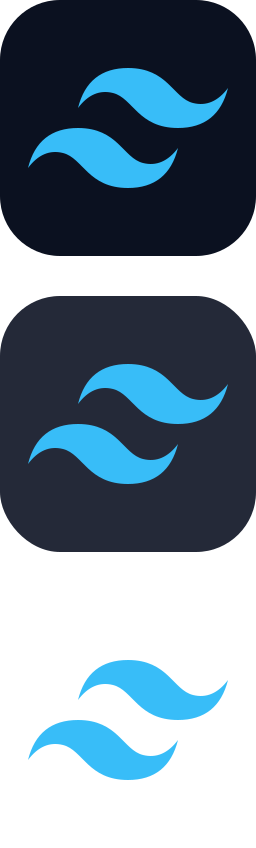 | 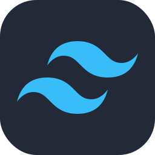 | 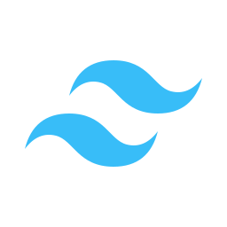 |
| `threejs` | 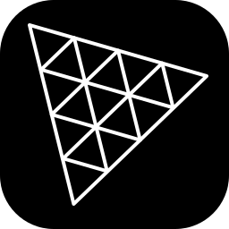 | 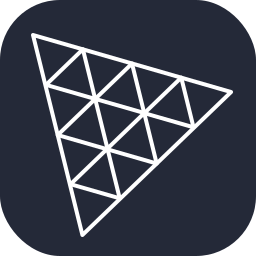 | 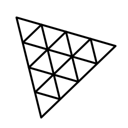 |

### Análise de Dados, Data Science e IA
| ID do Ícone | Colored | Dark | Light |
| :---------: | :-----: | :--: | :---: |
| `alteryx` | 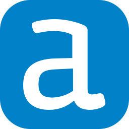 | 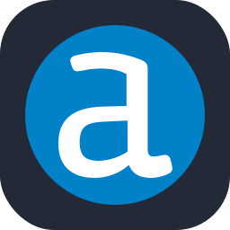 | 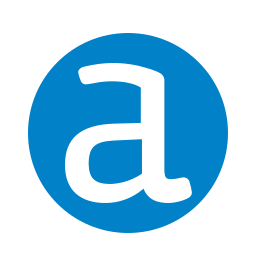 |
| `grafana` |  |  |  |
| `julia` | 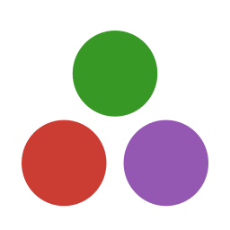 |  |  |
| `matlab` |  |  |  |
| `octave` |  |  |  |
| `opencv` |  |  |  |
| `powerbi` |  |  |  |
| `prometheus` |  |  |  |
| `pytorch` |  |  |  |
| `scikitlearn` |  |  |  |
| `sentry` |  |  |  |
| `tensorflow` |  |  |  |


<!--

## 💖 Support the Project

Thank you so much already for using my projects! If you want to go a step further and support my open source work, buy me a coffee:

<a href='https://ko-fi.com/Q5Q860KQ2' target='_blank'></a>

To support the project directly, feel free to open issues for icon suggestions, or contribute with a pull request! -->
